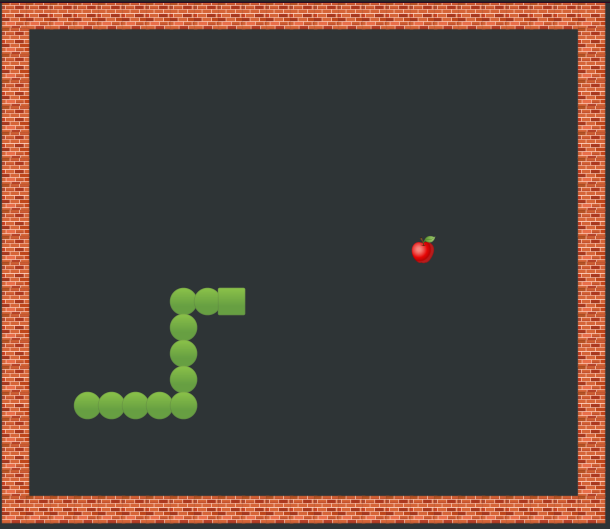

# Python Basics

In this course, we will work with a small terminal-based Snake game.
During the exercise, you will improve the program in small steps to develop it into
a clean, well-tested and maintainable piece of software.

You find a prototype of the game in the `snake_prototype/` folder.

## Preparations

The game uses the `curses` library to create 2D graphics.
On Windows, you need to install curses from a terminal with

    pip install windows-curses

Go to the `snake_prototype/` folder and run the snake game with

    python main.py
    
You should see a graphical scene as in the picture above.

Try to control the snake with the keys `AWSD`.

## Code Review

Inspect the two Python files.
Take notes to answer the following questions:

* What do you like about the code?
* What do you not like about the code?
* What would you like to know more about?

## Debug

The snake does not move correctly when you press the keys!

The `Snake` class in `game.py` contains 3 bugs.
Look at the code carefully in oder to fix them.

## Cleanup

The file `main.py` contains a lot of style issues (violations of the PEP8 standard).
Most of them can be removed automatically.
Install the `black` program:

    pip install black

and run it over all Python files

    black *.py

What does change?
