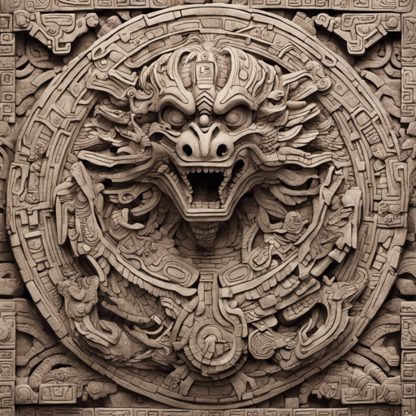

# Automated Tests

## Install pytest

Install the `pytest` library with:

    pip install pytest

## Write a Unit Test

Create a file `test_game.py`.
Add a test function to it:

    def test_create_game():
        """game object is created"""
        s = SnakeGame(size=(10, 10), start_pos=(5, 5))
        assert s.size == (10, 10)
        assert s.running

## Run the test

Execute the test from the main project folder with:

    pytest

You should see a test that passes.

## Test failure

Add another test:

    def test_string_conversion():
        """string representation works"""
        s = SnakeGame(size=(6, 5), start_pos=(1, 2))
        assert str(s) == """
    ######
    #*   #
    #G   #
    #    #
    ######""".strip()

Execute `pytest` again a few times. The test should fail at least once. Why?

## Mocking

Use the following lines to hijack the random number generator and fix the failing test:

    from unittest.mock import MagicMock, patch

    @patch("random.randint", MagicMock(return_value=1))
    def test_string_conversion():
        ...

## Fixture

The game has to be created in every test.
Move it to a special helper function called a **fixture**:

    import pytest

    @pytest.fixture
    def game():
        return SnakeGame(...)

Add a `game` parameter to test function. Pytest takes care of the rest.

## Test against bug

The `Snake.forward` method contains bugs.
Write a test for the `SnakeGame` object that catches the bug.
Use the following phrases to check whether the snake is moving in the proper direction.

    s = SnakeGame(...)
    s.set_direction(...)
    s.update()
    assert (x, y, HEAD) in s.get_symbols

**Note that we are not testing `Snake.forward` directly because it is not part of the public interface.

## Parametrized test

Create a version of the above test for each direction.
Use test parametrization to remove redundant code:

    import pytest

    EXAMPLES = [
        ...
    ]

    @pytest.mark.parametrize('direction,x,y', EXAMPLES) 
    def test_directions(direction, x, y):
        ...

## Test coverage

Check how much of the code is tested:

    pip install pytest-coverage

And run

    pytest --cov=.

## Tail

Write a test that checks whether the tail of the snake grows when it eats a fruit.

Complete the code.
